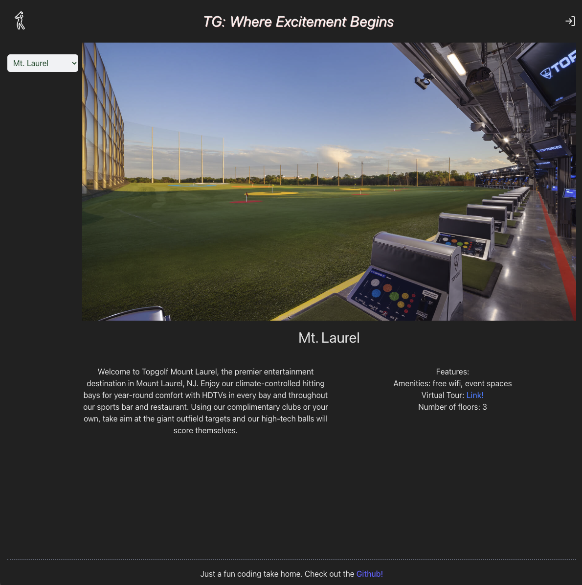
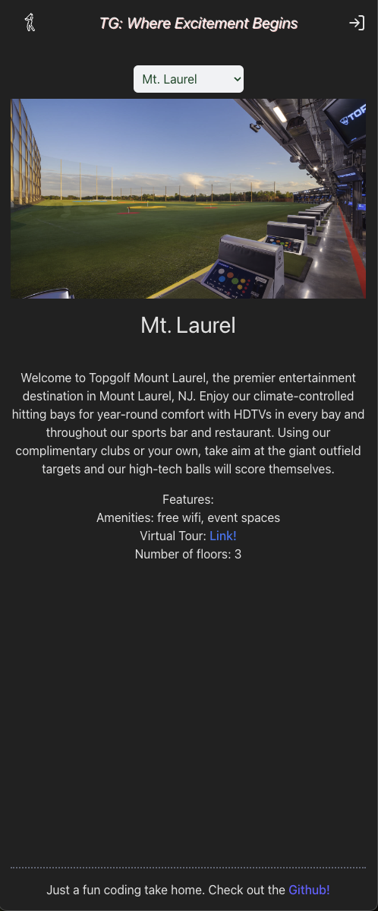

# FE Coding Challenge

A FE web app built with React, Typescript, and one expressJs route

#### Running the server:

```zsh
cd client
npm i
npm run serve
```

#### Running the client:

Note, will fail to fetch data if server is not running on port 3000.

```zsh
cd client
npm i
npm run dev
```

#### Libraries used:

- Vite - For bootstrapping build tooling and development server
- Axios - For fetching api requests from the server
- Zustand - Global state management library (Implementation of this was overkill but the setup and strategy may be better for scaling)
- eslint - Code linting
- Prettier - Code reformatting
- Vitest - Unit testing (needs to be expanded upon, more on this below)
- TailwindCSS - CSS framework
- Typescript - Type checking

#### Extraneous Resources:

- Golf Player SVG ([Sports Line Icons on Reshot](https://www.reshot.com/free-svg-icons/item/golf-player-BTSQDUZXYH/))
- SVG to TSX ([React-SVGR](https://react-svgr.com/playground/))

#### Scaling & Where to go from here

- Creating UI components for reusable functionality (e.g. the select dropdown, text)
- Add a router if it's a multipage application. For standard React apps, React Router is the de-facto standard
- React-Query can be popular for querying and observing querying state
- More unit testing. Integration and E2E testing with Cypress or another library
- There are many additional directions, features, and additions depending on the plans for the app. Some may include i18n for translation, storybook, and more.

#### Showcase




